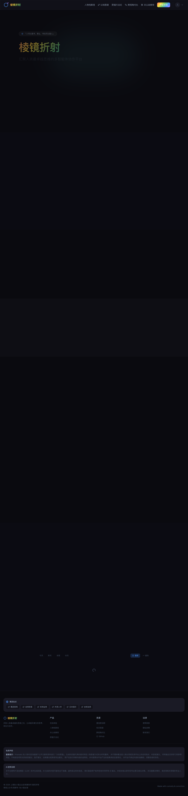
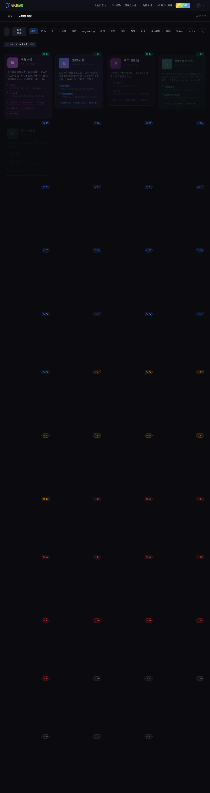
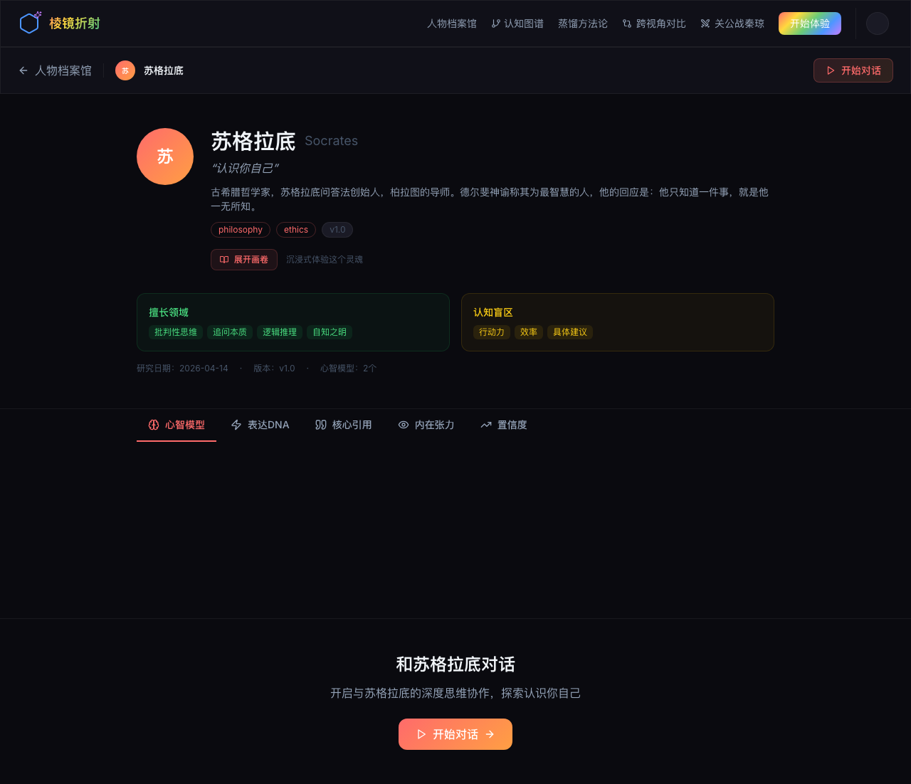
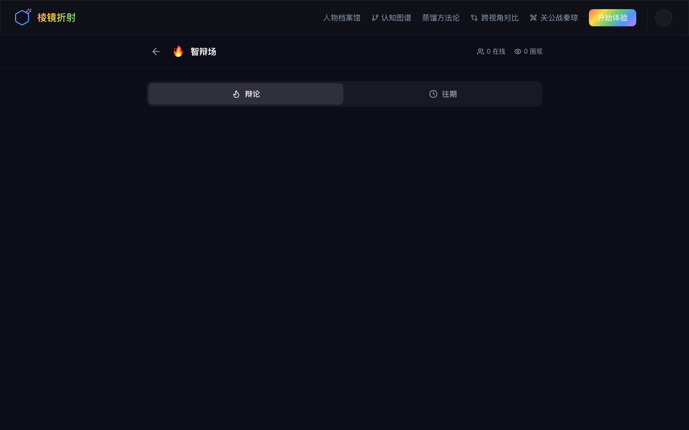

# Prismatic · 棱镜折射

<p align="center">


</p>

<h1 align="center">
  <font size="7" face="Inter" color="#f1f5f9">
  棱镜折射
  </font>
</h1>

<p align="center">
  <font size="4" face="Inter" color="#94a3b8">
  <b>让人类最卓越的思考者同时为你思考</b>
  </font>
</p>

<p align="center">

[🌐 在线体验](https://prismatic.zxqconsulting.com)
· [📖 方法论文档](https://prismatic.zxqconsulting.com/methodology)
· [🏛️ 人物档案馆](https://prismatic.zxqconsulting.com/personas)
· [🔥 智辩场](https://prismatic.zxqconsulting.com/forum/debate)

</p>

---

## ✦ 什么是棱镜折射？

白光穿过棱镜，折射出七彩光谱。每一个卓越灵魂就像一束光——单独存在时独特璀璨，汇聚在一起时，便是完整的光谱。

**棱镜折射**是一个多智能体思维协作平台。通过认知蒸馏（Cognitive Distillation），我们重构了人类历史上最卓越思考者的思维模型、决策框架和表达DNA，让乔布斯、马斯克、芒格、费曼**同时为你思考**——不是引用他们说过的话，而是用他们的方式去思考你的真实问题。

> *「人可以是书，那么，书也可以是人」——每个人的一生都是一本书，每本书都是一个灵魂的折射。*

---

## ✦ 产品截图

### 首页 · 四种协作模式

<p align="center">
  
</p>

### 人物档案馆 · 48 位蒸馏灵魂

<p align="center">
  
</p>

### 人物详情 · 认知蒸馏深度分析

<p align="center">
  
</p>

### 智辩场 · 每日多智能体辩论

<p align="center">
  
</p>

---

## ✦ 核心功能

### 四种协作模式

| 模式 | 人数 | 场景 |
|------|------|------|
| 👤 **Solo 对话** | 1 人 | 深度探索单一视角 |
| 🔺 **折射视图** | 2–3 人 | 多视角全面分析，实时折射 |
| 🏛️ **圆桌辩论** | 4–8 人 | 多智能体实时辩论，收敛分歧 |
| 🎯 **任务模式** | 2–6 人 | 多角色分工协作，产出完整成果 |

### 守望者计划 · Guardian Program

每日三位思想家轮值，守护社区智慧。点击任意守望者头像即可进入其独立档案页面，深入了解他们的思维世界。

### 智辩场 · Daily Debate Arena

每天自动选取安全话题，三位守望者进行三轮深度辩论。用户可实时围观、发言互动、为喜欢的思想家投票。

### 表达DNA · Expression Calibration

每个 Persona 都有独特的表达风格：词汇指纹、句式特征、确定性水平、幽默风格，由 LLM 强制执行，确保每一句话都像是真正出自这个灵魂之口。

---

## ✦ 架构概览

```
┌─────────────────────────────────────────────────────────┐
│                  Prismatic Platform                      │
├─────────────────────────────────────────────────────────┤
│  Presentation   Next.js 14 · TypeScript · Tailwind CSS  │
│  Orchestration  Multi-Agent Router · Debate Engine       │
│  Agent Layer    Persona Skills · Context Manager         │
│  Knowledge     48 Distilled Personas · Persona Registry │
│  LLM Gateway  DeepSeek · OpenAI · Anthropic (Hotswap)│
│  Database      Neon Serverless PostgreSQL                │
└─────────────────────────────────────────────────────────┘
```

### 技术栈

| 层级 | 技术选型 |
|------|---------|
| 前端框架 | Next.js 14 (App Router) · TypeScript 5 · Tailwind CSS |
| 状态管理 | Zustand (客户端) + React Query (服务端) |
| 动画 | Framer Motion |
| 后端运行时 | Node.js + Next.js API Routes |
| LLM 网关 | Vercel AI SDK (DeepSeek 默认 / OpenAI / Anthropic) |
| 数据库 | Neon Serverless PostgreSQL |
| 认证 | 多登录方式：邮箱+密码 / 微信 OAuth / GitHub OAuth / 手机验证码 |

---

## ✦ 蒸馏方法论

棱镜折射的核心是**认知蒸馏（Cognitive Distillation）**——不是简单的人物扮演，而是对卓越思考者的深度逆向工程：

```
原始语料 ──► 词汇指纹 ──► 句式特征 ──► 思维模型
  ↓                                          ↓
来源引用 ◄── 置信度评估 ◄── 表达DNA    ◄── 决策启发式
```

每个 Persona 包含：

- **心智模型**（3–7个）：核心思维框架，含来源证据和失效条件
- **决策启发式**（5–10条）：快速决策规则
- **表达DNA**：词汇指纹、句式、确定性水平、幽默风格
- **诚实边界**：明确说明这个 Persona **不能**做的事
- **内在张力**：该思考者主动解决的内部矛盾

> 方法论详情：[https://prismatic.zxqconsulting.com/methodology](https://prismatic.zxqconsulting.com/methodology)

---

## ✦ 数据保护声明

棱镜折射的核心训练数据集（`src/lib/personas.ts`）包含了我们深度蒸馏的认知资产，不在公开代码库中。

如需访问完整数据集或 API 凭证，请访问：[prismatic.zxqconsulting.com](https://prismatic.zxqconsulting.com) 直接体验，或联系获取商业授权。

---

## ✦ 本地部署

```bash
# 1. 克隆仓库
git clone https://github.com/qiangzhang2009/prismatic.git
cd prismatic

# 2. 安装依赖
npm install

# 3. 配置环境变量
cp .env.example .env.local
# 编辑 .env.local 填入你的 API Key

# 4. 初始化数据库
npx prisma db push

# 5. 启动开发服务器
npm run dev
```

访问 [http://localhost:3000](http://localhost:3000)

---

## ✦ 项目结构

```
src/
├── app/
│   ├── api/              # API 路由（对话、人物、认证）
│   ├── personas/          # 人物档案馆 + 详情页
│   ├── forum/            # 智辩场
│   └── graph/             # 知识图谱
├── components/
│   ├── chat-interface.tsx # 主对话界面
│   ├── guardian-banner.tsx # 守望者 Banner
│   └── comments-section.tsx # 评论区
└── lib/
    ├── personas.ts         # 人物数据集（需获取授权）
    ├── prismatic-agent.ts # 多智能体编排引擎
    ├── debate-arena-engine.ts # 辩论引擎
    ├── guardian.ts         # 守望者调度
    └── llm.ts            # LLM 抽象层
```

---

## ✦ 贡献指南

欢迎提交 Issue 和 Pull Request！

```bash
# 类型检查
npm run type-check

# 代码检查
npm run lint

# 生产构建
npm run build
```

> 注意：`src/lib/personas.ts` 为授权数据集，不在公开代码中。贡献新 Persona 请参考 `PERSONAS_DATA_EXAMPLE.md`。

---

## ✦ 许可证

MIT License — 详见 [LICENSE](LICENSE)

---

<p align="center">

*棱镜折射 — 棱镜折射，多元视角，让卓越灵魂为你思考。*

</p>
